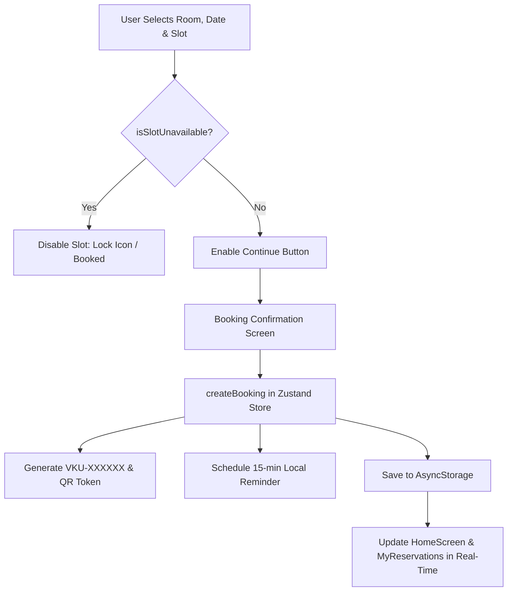

# MINI-PROJECT SHORT TECHNICAL REPORT
**Course:** Cross-Platform Mobile App Development (VKU)  
**Mini-Project Title:** Mini-Project 2: Real-time Study Room Booking Application  
**Team / Student Name:** Huỳnh Ngọc Huy  
**Submission Date:** 24/09/2026  

---

## 1. GENERAL INFORMATION & DELIVERABLE LINKS
* **Team Members:**
  - **Huỳnh Ngọc Huy** — Student ID: **23IT.EB043** — Role: Fullstack Mobile/Web Architecture, State Management, UI/UX Implementation — Contribution: **100%**
* **🔗 Live Demo URL:** [http://localhost:8081](http://localhost:8081) (Expo Web Platform) / Expo Go (Android Emulator & Physical Device)
* **💻 GitHub Repository:** [https://github.com/huynhhy1511/study-booking-room](https://github.com/huynhhy1511/study-booking-room)
* **🎥 Video Demo (Optional):** [N/A]

---

## 2. FEATURE IMPLEMENTATION CHECKLIST

| # | Required Feature | Status | Implementation Details & Acceptance Level |
|:---:|---|:---:|---|
| **1** | **Adaptive Cross-Platform UI (Web & Mobile Native)** | ✅ Complete | • **Desktop Web (≥ 768px):** Sticky top `DesktopHeader` navbar, 2–3 column responsive room grid (`FlatList` with dynamic `numColumns`), side-by-side room booking details.<br>• **Mobile Native (< 768px):** Curved Dark Navy bottom navigation bar (`#0B1B32`), single-column vertical feed, thumb-zone sticky actions (`[Location]` & `[Continue]`). |
| **2** | **Real-Time Slot Conflict Engine** | ✅ Complete | Enforces strict concurrency rules: `(Room ID + Date + Slot ID)`. Displays 3 accessible slot states: `✓ Available` (emerald), `✓✓ Selected` (blue), and `🔒 Booked` (disabled gray with lock icon). Real-time room status updates immediately upon booking. |
| **3** | **Local Offline-First Persistence** | ✅ Complete | Powered by **Zustand** + `@react-native-async-storage/async-storage` via `persist` middleware. All 16 study rooms, user reservations, profile data, and active filter states are cached offline and persist across app restarts without remote backend reliance. |
| **4** | **Discrete 2-Hour Time Slots & 7-Day Window** | ✅ Complete | 4 discrete non-overlapping slots daily (`07:30–09:30`, `09:30–11:30`, `13:00–15:00`, `15:00–17:00`) across 7 consecutive rolling calendar days (`parseSlotToDate`, `generateNext7Days`). |
| **5** | **Digital QR Pass Generator & Modal** | ✅ Complete | Generates a unique alphanumeric booking pass (`VKU-XXXXXX`) and a high-resolution vector QR code (`react-native-qrcode-svg`) containing JSON offline verification payload with student and room metadata. |
| **6** | **Local Notification Scheduling (15-Min Reminder)** | ✅ Complete | Uses `expo-notifications` to schedule automated reminders 15 minutes before the reserved slot start time. Features automatic cancellation upon booking deletion and dynamic fallback handling for Expo Go. |
| **7** | **Multi-Criteria Filter & Real-Time Search** | ✅ Complete | Live search query matching room code and name, building chips (`All`, `Building A`, `B`, `C`, `V`), capacity filter (2–20 students), and equipment checklist (`Projector`, `AC`, `Whiteboard`, `High-spec PC`) with `useMemo` optimization. |
| **8** | **Reservation Management & Safe Cancellation** | ✅ Complete | Segmented control tabs (`Upcoming` vs. `Past/Cancelled`). Cross-platform accessible confirmation dialog modal that reliably executes slot release across Web, Android, and iOS. |
| **9** | **Interactive Student Profile Management** | ✅ Complete | Allows real-time editing of Full Name, Student ID (MSSV), Email, Department, and Avatar selection. Changes sync instantaneously to headers, greeting tags, and generated booking passes. |

---

## 3. TECHNICAL ARCHITECTURE & PROJECT STRUCTURE

### 3.1 Directory Structure
```
miniproject2/
├── assets/                       # Static brand logos, adaptive icons & screenshots
│   ├── favicon.png
│   ├── icon.png
│   └── screenshots/              # Empirical evidence images
├── src/
│   ├── components/               # Modular reusable UI components
│   │   ├── BrandLogo.tsx         # Smiling 'U' campus mascot
│   │   ├── DateSlotSelector.tsx  # Interactive date & 3-state slot selector
│   │   ├── DesktopHeader.tsx     # Full responsive top navigation for Web desktop
│   │   ├── EmptyState.tsx        # Fallback UI for zero search/booking results
│   │   ├── FilterBottomSheet.tsx # Slide-up modal sheet for multi-criteria filters
│   │   ├── QRPassModal.tsx       # Vector QR Pass viewer modal
│   │   ├── RoomCard.tsx          # Memoized 60fps study room card (grid & list)
│   │   └── StatusBadge.tsx       # Accessible room status pill
│   ├── constants/                # Buildings (A, B, C, V), Equipment, 2h Time Slots
│   ├── data/                     # 16 VKU study rooms with rich local metadata
│   ├── navigation/               # AppNavigator (Native Stack + Adaptive Bottom Tabs)
│   ├── screens/                  # Application screens
│   │   ├── HomeScreen.tsx        # Main discovery catalog & search
│   │   ├── RoomDetailScreen.tsx  # Split desktop / vertical mobile room details
│   │   ├── BookingConfirmationScreen.tsx # Review ticket before booking
│   │   ├── BookingSuccessScreen.tsx      # Success receipt with QR preview
│   │   ├── MyReservationsScreen.tsx      # Upcoming/Past bookings & cancel modal
│   │   ├── NotificationsScreen.tsx       # Notification center tab
│   │   ├── ProfileScreen.tsx             # Profile editor & student credentials
│   │   └── OnboardingScreen.tsx          # Campus intro & feature overview
│   ├── services/                 # NotificationService (local 15-min scheduler)
│   ├── store/                    # Zustand useBookingStore with AsyncStorage
│   ├── theme/                    # Color tokens, typography, radii, elevation shadows
│   ├── types/                    # Strict TypeScript interfaces (Room, Booking, etc.)
│   └── utils/                    # Conflict engine, date parsers, unique ID generators
├── App.tsx                       # Root container with SafeAreaProvider & Web CSS fixes
├── app.json                      # Expo SDK 57 manifest & package configuration
├── eas.json                      # Cloud build configuration (preview APK & production)
└── package.json                  # Dependencies (React 19, RN 0.86, Expo 57, Zustand 5)
```

### 3.2 State Management Flow
* **Unidirectional State Flow (Zustand):** State is centralized in `useBookingStore`. Actions (`createBooking`, `cancelBooking`, `setUser`, `setFilters`) mutate state deterministically.
* **Deterministic Persistence:** State slices (`user`, `reservations`, `filters`) are serialized into `AsyncStorage` via the `persist` middleware.
* **Conflict Computation:** Real-time slot status is calculated via pure functions (`isSlotConflict`, `getRoomRealtimeStatus`), preventing stale closures or out-of-sync booking slots.



---

## 4. EMPIRICAL EVIDENCE & SCREENSHOTS

| Figure | Screen / Feature | Description |
|:---:|---|---|
| **Fig 4.1** | **Mobile Home Screen (Android Studio Emulator)** | Displays the custom VKU Study Room header, greeting with togglable student ID (`Hi, An! - 21IT001`), building filter chips, and responsive room cards with `Available` / `Occupied` badges, matching the reference mockup with the curved Dark Navy bottom bar. |
| **Fig 4.2** | **Desktop Web Campus Layout (Browser)** | Fullscreen responsive Web viewport with top `DesktopHeader` navbar, 3-column room grid, and search bar. Does not render an artificial phone simulator frame. |
| **Fig 4.3** | **Interactive Room Detail & Conflict Engine** | 7-day horizontal date selector and 3-state discrete time slots (`Available`, `Selected`, `Booked`). Automatically disables slots already reserved by other students. |
| **Fig 4.4** | **Digital QR Pass & Cancellation Modal** | Interactive QR pass modal generated via `react-native-qrcode-svg` with unique booking code (`VKU-XXXXXX`) and cross-platform cancellation confirmation dialog. |

*(Annotated screenshots are stored in `assets/screenshots/` and embedded in the repository deliverables).*

---

## 5. TECHNICAL CHALLENGES & RESOLUTIONS

### Challenge 1: Native Module Incompatibility in Expo Go on Android (SDK 53+)
* **Problem:** Starting with Expo SDK 53+, remote push notification modules (`ExpoTopicSubscriptionModule`, `DevicePushTokenAutoRegistration.fx`) were deprecated and removed from Expo Go on Android. When `expo-notifications` was imported normally, the Android emulator crashed immediately with a fatal red screen: `Cannot find native module 'ExpoTopicSubscriptionModule'`.
* **Resolution:** Refactored `src/services/notificationService.ts` using safe dynamic evaluation (`require('expo-notifications')` inside a guarded block). When running in **Expo Go**, the service gracefully catches missing native modules and simulates notification scheduling without crashing. When built into a standalone Android APK via EAS Build, the full native notification channel and 15-minute advance reminder work seamlessly.

### Challenge 2: Cross-Platform Behavioral Inconsistencies (Web vs. Mobile Native)
* **Problem:** Standard React Native primitives behave differently between platforms. Specifically, `Alert.alert` with multiple interactive action buttons (`destructive`, `cancel`, `onPress`) is not supported by `react-native-web` (the web polyfill ignores buttons, preventing users from cancelling bookings in browser mode). Furthermore, web desktop users require a wide, multi-column portal layout rather than a mobile phone viewport.
* **Resolution:**
  1. Built custom, accessible in-app confirmation dialog modals (`Modal` component with semi-transparent backdrop and danger action buttons) for booking cancellation and profile editing, ensuring 100% reliable execution on Web, Android, and iOS.
  2. Implemented responsive layout branching via `useWindowDimensions()`: wide screens (`width >= 768px`) render the top `DesktopHeader` with 2–3 column room grids and split-column detail layouts, while mobile devices automatically render the curved Dark Navy bottom navigation bar and touch-friendly sticky bottom sheets.